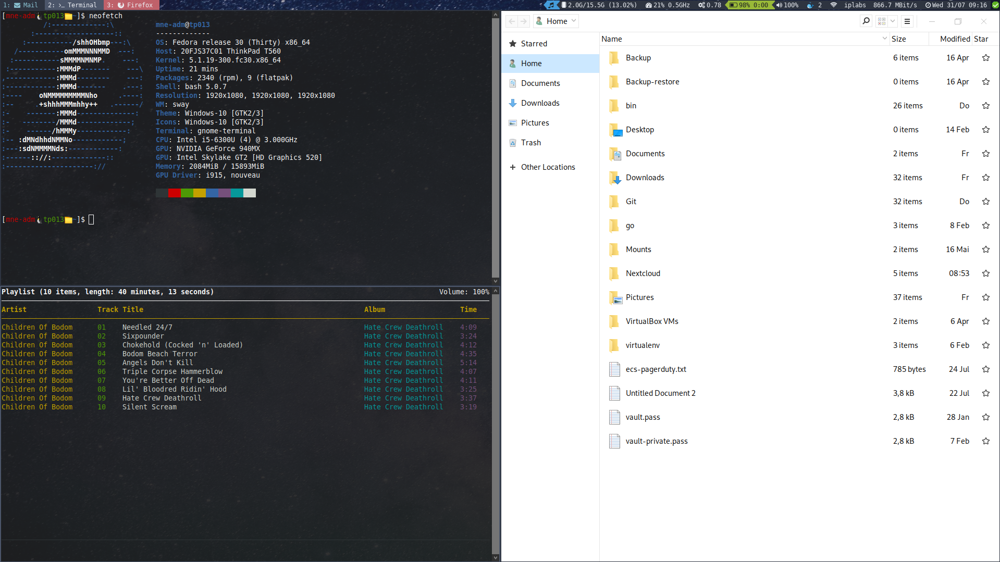

# i3 Molokai with gome-flashback []()



Why gnome-flashback? Because it does support me with the sound, display and bluetooth configuration and supports thinks like dynamically changing the display in case I e.g. take my notebook out of the docking station.

## Current setup

* **OS:** Fedora 29
* **Shell:** Bash
* **Desktop Environment:** Gnome-Flashback
* **Window Manager:** i3-gaps
* **Bar:** i3blocks
* **Launcher:** Rofi
* **Theme:** Molokai
* **Terminal:** gnome-terminal
* **GTK:** [Windows 10](https://www.gnome-look.org/p/1013482/)
* **Icons:** [Windows 10](https://github.com/B00merang-Artwork/Windows-10)

## Installation

Run setup.sh. The most part of the script is independend and can be done on every linux distribution. There is only a small part, adding repositories and installing software, at the beginning of the script that is fedora specific. This part can be easily extended. But only Fedora is tested by me.

During installation the script will do the following changes to the system:

* Add the following repos from fedora copr:

  * [pkgbot/pkgs](https://copr.fedorainfracloud.org/coprs/pkgbot/pkgs/) for the i3 environment

  * [victoroliveira/gnome-flashback](https://copr.fedorainfracloud.org/coprs/victoroliveira/gnome-flashback/) for gnome-flashback

* Install required software (see setup.sh for details)

* Install [csxr's i3-gnome](https://github.com/csxr/i3-gnome) integration

* Files from the config folder will be symlinked to the appropriate location

* i3block scripts will be downloaded from [i3-contrib repository](https://github.com/vivien/i3blocks-contrib) to ~/.config/i3/scripts

* Add entries to /root/.bashrc and ~/.bashrc

## Manual Setup

The GTK Theme and Icons need to be downloaded manually.

* .config/gtk-3.0/settings.ini

```
[Settings]
gtk-theme-name = Windows-10-2.0.1
gtk-icon-theme-name = Windows-10
```
