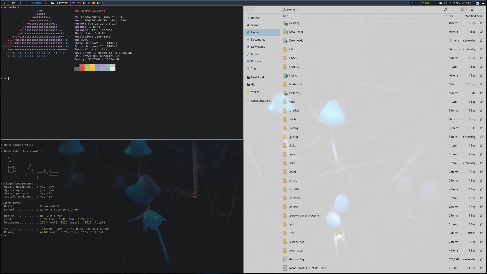

# Sway []()  [](https://opensource.org/licenses/MIT)

<div align="center"><b><a href="https://swaywm.org/" target="_blank">Sway</a> configuration of my desktop environment.</b></div>



More Screenshots can be found in the [screenshots](screenshots/) folder.

## Table of content

* [Current setup](#current-setup)
* [Features](#features)
* [Prerequisites](#prerequisites)
* [Installation](#installation)
* [Applications beeing installed](#applications-beeing-installed)
  * [Arch Repository](#arch-repository)
  * [Aur](#aur)
* [Hotkeys](#hotkeys)
* [Custom Sway configuration](#custom-sway-configuration)
  * [Device specific configuration](#device-specific-configuration)
  * [Output configuration](#output-configuration)
* [Custom bash configuration](#custom-bash-configuration)
* [Correct weather information in waybar](#correct-weather-information-in-waybar)
* [Mozilla Firefox and Thunderbird](#mozilla-firefox-and-thunderbird)

## Current setup

* **OS:** [Arch](https://www.archlinux.org/)
* **Shell:** [Bash](https://www.gnu.org/software/bash/)
* **Wayland compositor:** [Sway](https://github.com/swaywm/sway)
* **Bar:** [Waybar](https://github.com/Alexays/Waybar)
* **Launcher:** [gmenu](https://git.sr.ht/~tslocum/gmenu)
* **Terminal:** [Alacritty](https://github.com/alacritty/alacritty)
* **Color Scheme:** Based on [Nord theme](https://www.nordtheme.com/)
* **GTK:** [Windows 10](https://www.gnome-look.org/p/1013482/)
* **Icons:** [Windows 10](https://github.com/B00merang-Artwork/Windows-10)
* **Prompt:** [Starship](https://github.com/starship/starship)

## Features

* Services are started / stopped via systemd when sway starts / stops
* Dynamic monitor [output configuration](#output-configuration) via kanshi, even when reloading sway via $mod1+Shift+C
* [Device specific sway configuration](#device-specific-configuration)
* Multi-monitor lock screen support via [swaylock-effects](https://github.com/mortie/swaylock-effects)
* Notifications support via mako
* Window activity follows mouse
* Inactive windows are semi-transparent
* Suppress Lockscreen when a window is in fullscreen, usefull when e.g. watching videos
* Multiple [floating window rules](config/sway/sway.d/06_floating.conf) for a more familiar desktop feeling
* Tag XWayland windows with an [X] in title bar to know which application is wayland native
* Alacritty as "scratchpad terminal"
* Waybar tooltips actually do feel like tooltips and not like a sway application container

## Prerequisites

* git
* ansible >= 2.7
* When using arch: [ansible-aur module](https://github.com/kewlfft/ansible-aur), though it will be installed when using the playbook setup01-arch-prerequirements.yml

## Installation

I prefer using ansible for managing my desktop environment so you need it to install everything.

* integrated idempotence tests
* templating
* been using it on a daily base
* can use system facts, e.g. ansible_distribution

```bash
ansible-playbook setup-01-arch-prerequirements.yml -K -e 'ansible_python_interpreter=/usr/bin/python3'
ansible-playbook setup-02-de.yml -K -e 'ansible_python_interpreter=/usr/bin/python3'
ansible-playbook setup-03-additions-arch.yml -K -e 'ansible_python_interpreter=/usr/bin/python3'
```

At the moment main focus is on arch, was previously on Fedora. But Fedora has become obsolete and removed.

The ansible playbook will do the following changes to the system:

* Install required software (see the playbook *.yml files for details)

* Files from the config folder will be symlinked to the appropriate location

* Enables ssh-agent via systemd --user

* Downloads Windows-10 themes and icons to ~/.themes and ~/.icons

* Sets Windows-10 themes and icons in ~/.config/gtk-3.0/settings.ini and ~/.gtkrc-2.0

  * ~/.config/gtk-3.0/settings.ini

  ```bash
  [Settings]
  gtk-theme-name = Windows-10
  gtk-icon-theme-name = Windows-10
  ```

  * ~/.gtkrc-2.0

  ```bash
  gtk-theme-name = Windows-10
  gtk-icon-theme-name = Windows-10
  ```

* [Add entries to /root/.bashrc and ~/.bashrc](#custom-bash-configuration)

* Install / remove some GTK applications I need. I try to avoid QT applications if I'm not forced to use them...

## Applications beeing installed

This role installs multiple applications from arch repository and aur.

### Arch Repository

| Name | Description |
| --- | --- |
| [Alacritty](https://github.com/alacritty/alacritty) | A cross-platform, GPU-accelerated terminal emulator |
| [blueman](https://github.com/blueman-project/blueman) | Blueman is a GTK+ Bluetooth Manager |
| [grim](https://github.com/emersion/grim) | Grab images from a Wayland compositor |
| imagemagick |  |
| jq |  |
| [kanshi](https://github.com/emersion/kanshi) |  |
| [mako](https://github.com/emersion/mako) | A lightweight Wayland notification daemon |
| most |  |
| ncmpcpp |  |
| network-manager-applet |  |
| noto-fonts-emoji |  |
| otf-font-awesome |  |
| pavucontrol |  |
| playerctl |  |
| polkit-gnome |  |
| qt5-wayland |  |
| slurp |  |
| sway |  |
| swayidle |  |
| ttf-dejavu |  |
| waybar |  |

### Aur

| Name | Description |
| --- | --- |
| [avizo](https://github.com/misterdanb/avizo) | Avizo is a simple notification daemon, intended to be used for multimedia keys |
| [gmenu](https://gitlab.com/tslocum/gmenu) | Desktop application launcher written in go |
| [otf-font-awesome-4](https://aur.archlinux.org/packages/otf-font-awesome-4/) |  |
| [redshift-wlr-gamma-control-git](https://github.com/minus7/redshift/tree/wayland) | Adjust color temperature in the evening |
| [starship-bin](https://github.com/starship/starship) | The minimal, blazing-fast, and infinitely customizable prompt for any shell |
| [swaylock-effects-git](https://github.com/mortie/swaylock-effects) | Swaylock, with fancy effects |
| [ttf-font-awesome-4](https://aur.archlinux.org/packages/ttf-font-awesome-4/) |  |
| [wl-clipboard-git](https://github.com/bugaevc/wl-clipboard) | Command-line copy/paste utilities for Wayland |

## Hotkeys

This is not a list of all hotkeys but more for some none defaults. You can view all hotkeys in **config/sway.d/07_hotkeys.conf**.

Or alternatively in the [HOTKEYS.md](HOTKEYS.md) file.

By default $mod is the super key (or windows key).

| Action | Binding |
| --- | --- |
| Open gmenu | $mod+d |
| Toggle Redshift | $mod+Shift+t |
| Make current focus fullscreen | $mod+f |
| Make current container fullscreen | $mod+Shift+f |
| Open KeePass2 from scratchpad | $mod+k |
| Screenshot whole screen | Print |
| Screenshot focused window | $mod+Print |
| Screenshot selected region | $mod+Shift+Print |
| Desktop color picker | $mod+c |
| Open floating terminal | Menu |

Screenshots are saved to **$XDG_PICTURES_DIR/screenshot_YYYY-MM-DD_HH24-MI-SS_SSS.png** and the path is copied to clipboard.

## Custom Sway configuration

In git all config/sway.d/99_*.conf files are ignored. You can add your own configuration there.

Alternatively you can create a folder with the hostname of your device and put device specific configuration in there.

```bash
mkdir -p $HOME/.config/sway/$(hostname)
```

### Device specific configuration

At the moment the following settings are considered device specific:

* Background (02_output.conf)

* Workspace to monitor assignment (03_workspace.conf)

The files do provide some commented examples. You can copy them to **$HOME/.config/sway/$(hostname)** and adjust them to your needs.

### Output configuration

In the past I used sway to handle monitor configuration (e.g. resolution and position). But it wasn't reliable for me so I switched to [kanshi](https://github.com/emersion/kanshi). Kanshi dynamically changes output configuration depending on the connected devices, which sway can't. Very convenient when using a notebook on different places. You can find an example configuration in [config/kanshi/config.example](/config/kanshi/config.example).

## Custom bash configuration

The playbooks do add the following lines to your ~/.bashrc and /root/.bashrc:

```bash
 # BEGIN Sway desktop environment config
for f in ~/.config/bash/*.sh; do source $f; done
 # END Sway desktop environment config
```

This will source all *.sh files from your ~/.config/bash folder.

## Correct weather information in waybar

Weather information are provided by [wttr.in](http://wttr.in) and downloaded with a scrip from [Robinhuet](https://github.com/Robinhuett). To get correct weather information in waybar for your location add the following variable to your .pam_environment:

```clean
WEATHER_LOC=44444
```

## Mozilla Firefox and Thunderbird

Both applications will be started with native wayland support. For best performance in Firefox you need to enable the new WebRender.

```clean
about:config --> gfx.webrender.all --> Value: True
```

To verify if it's enabled go to **about:support** and check if **Compositing** contains the value **WebRender**. This can lead to problems on some configurations because the WebRender is still beta.
