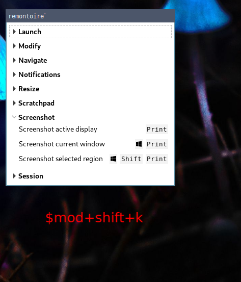

# Sway []()  [](https://opensource.org/licenses/MIT)

<div align="center"><b>My <a href="https://swaywm.org/" target="_blank">Sway</a> configuration.<br/>DE stands for desktop environment because I strive to create an easy to use feeling similar to a DE.</b></div>


More Screenshots can be found in the [screenshots](screenshots/) folder.

## Table of content

* [Current setup](#current-setup)
* [Features](#features)
* [Prerequisites](#prerequisites)
* [Installation](#installation)
* [Applications beeing installed](#applications-beeing-installed)
  * [Arch Repository](#arch-repository)
  * [Aur](#aur)
* [Hotkeys](#hotkeys)
* [Custom Sway configuration](#custom-sway-configuration)
  * [Device specific configuration](#device-specific-configuration)
  * [Output configuration](#output-configuration)
  * [Example host specific configuration](#example-host-specific-configuration)
* [Clipboard Manager](#clipboard-manager)
* [Custom bash configuration](#custom-bash-configuration)
* [Environment variables](#environment-variables)
  * [Weather information in waybar](#weather-information-in-waybar)
  * [Gammastep](#gammastep)
* [Mozilla Firefox and Thunderbird](#mozilla-firefox-and-thunderbird)
* [Breaking Changes](#breaking-changes)

## Current setup

* **OS:** [EndeavourOS](https://endeavouros.com/) (Arch Based)
* **Shell:** [Bash](https://www.gnu.org/software/bash/)
* **Wayland compositor:** [Sway](https://github.com/swaywm/sway)
* **Bar:** [Waybar](https://github.com/Alexays/Waybar)
* **Launcher:** [bemenu](https://github.com/Cloudef/bemenu) as wayland native dmenu
* **Terminal:** [Alacritty](https://github.com/alacritty/alacritty)
* **Color Scheme:** Based on [Nord theme](https://www.nordtheme.com/)
* **GTK:** [Windows 10](https://www.gnome-look.org/p/1013482/)
* **Icons:** [Windows 10](https://github.com/B00merang-Artwork/Windows-10)
* **Prompt:** [Starship](https://github.com/starship/starship)
* **Background:** [Mushrooms](https://wallpaperscraft.com/download/mushrooms_toadstools_glow_135444/3840x2160)

## Features

* Services are started / stopped via systemd when sway starts / stops
* Dynamic monitor [output configuration](#output-configuration) via kanshi, even when reloading sway via $mod+Shift+C
* [Device specific sway configuration](#device-specific-configuration)
* Multi-monitor lock screen support via [swaylock-effects](https://github.com/mortie/swaylock-effects)
* Notifications support via mako
* Window activity follows mouse
* Inactive windows are semi-transparent
* Suppress lockscreen when a window is in fullscreen, usefull when e.g. watching videos
* Multiple [floating window rules](config/sway/sway.d/06_floating.conf) for a more familiar desktop feeling
* Tag XWayland windows with an [X] in title bar to know which application is wayland native
* Alacritty as "scratchpad terminal"
* Waybar tooltips actually do feel like tooltips and not like a sway application container
* Setting custom environment variables to tailor the desktop environment to your needs
* Wayland Screensharing via [script](screenshots/SCREENSHARING.md) or natively in browsers via  [xdg-desktop-portal-wlr](https://github.com/emersion/xdg-desktop-portal-wlr)
* [Autotiling](https://github.com/nwg-piotr/autotiling) depending on the currently focused window dimensions
* [Hotkey Dialog](./screenshots/README.md#remontoire-hotkey-overview-modshiftk). View every available Hotkey in your sway session
* [Emoji selector](./screenshots/README.md#emoji-selector-alte) via bemenu. Select an emoji from a drop down menu and put it into your clipboard or [configure ydotool](.bin/dmenuunicode.sh) to automatically input it into any application
* [Color adaptive waybar](./screenshots/README.md#color-adaptive-waybar)
* Automount removable drives via [udiskie](https://pypi.org/project/udiskie/)
* Full QHD Support (I also assume WHD). I haven't noticed scaling problems with XWayland applications
* Clipboard Manager (clipman) which hides KeePassXC data

## Prerequisites

* git
* ansible >= 2.7
* When using arch: [ansible-aur module](https://github.com/kewlfft/ansible-aur), though it will be installed when using the playbook setup01-arch-prerequirements.yml
* Disable your display manager. It can work, but I can not guarantee it because I do not use one

## Installation

I prefer using ansible for managing my desktop environment so you need it to install everything.

Reasons why I use ansible:

* integrated idempotence tests
* templating
* been using it on a daily base
* can use system facts, e.g. ansible_distribution

The playbooks are completely idempotent and can be re-run without problems. The playbook setup-01 is required for the other playbooks as it will install the ansible aur module. setup-02 installs the desktop environment and setup-03 does adjustments mainly to suit my preferences, which can also be useful for others. Every task in the playbooks has a describing name. So it should be easy even without ansible knowledge to know, what each task does.

```bash
ansible-playbook setup-01-arch-prerequirements.yml -K -e 'ansible_python_interpreter=/usr/bin/python3' --diff
ansible-playbook setup-02-de.yml -K -e 'ansible_python_interpreter=/usr/bin/python3' --diff
ansible-playbook setup-03-additions-arch.yml -K -e 'ansible_python_interpreter=/usr/bin/python3' --diff
```

At the moment my main focus is on arch. It was previously on Fedora. But Fedora has become obsolete and got removed.

The ansible playbook will do the following changes to the system:

* Install required software (see the playbook *.yml files for details)

* Files from the config folder will be symlinked to the appropriate location

* Enables ssh-agent via systemd --user

* Downloads Windows-10 themes and icons to $HOME/.local/share/.themes and $HOME/.local/share/.icons

* Sets Windows-10 themes and icons in ~/.config/gtk-3.0/settings.ini and ~/.gtkrc-2.0

  * ~/.config/gtk-3.0/settings.ini

  ```bash
  [Settings]
  gtk-theme-name = Windows-10
  gtk-icon-theme-name = Windows-10
  ```

  * ~/.gtkrc-2.0

  ```bash
  gtk-theme-name = Windows-10
  gtk-icon-theme-name = Windows-10
  ```

* [Add entries to /root/.bashrc and ~/.bashrc](#custom-bash-configuration)

* setup03 installs / removes some GTK applications. I try to avoid QT applications if I'm not forced to use them...

## Applications beeing installed

This role installs multiple applications from arch repository and aur.

### Arch Repository

| Name                                                  | Description                                         |
| ----------------------------------------------------- | --------------------------------------------------- |
| [Alacritty](https://github.com/alacritty/alacritty)   | A cross-platform, GPU-accelerated terminal emulator |
| antiword                                              |                                                     |
| [bemenu](https://github.com/Cloudef/bemenu)           | Dmenu replacement                                   |
| bemenu-wlroots                                        | Wayland renderer for bemenu                         |
| [blueman](https://github.com/blueman-project/blueman) | Blueman is a GTK+ Bluetooth Manager                 |
| cdrtools                                              |                                                     |
| docx2txt                                              |                                                     |
| ffmpeg                                                |                                                     |
| [gammastep](https://gitlab.com/chinstrap/gammastep)   | Adjust color temperature in the evening             |
| gnome-power-manager                                   |                                                     |
| [grim](https://github.com/emersion/grim)              | Grab images from a Wayland compositor               |
| highlight                                             |                                                     |
| imagemagick                                           |                                                     |
| jq                                                    |                                                     |
| [kanshi](https://github.com/emersion/kanshi)          |                                                     |
| libpipewire02                                         |                                                     |
| lsd                                                   |                                                     |
| [mako](https://github.com/emersion/mako)              | A lightweight Wayland notification daemon           |
| ncmpcpp                                               |                                                     |
| network-manager-applet                                |                                                     |
| noto-fonts-emoji                                      |                                                     |
| odt2txt                                               |                                                     |
| otf-font-awesome                                      |                                                     |
| pavucontrol                                           |                                                     |
| pcmanfm-gtk3                                          |                                                     |
| perl-image-exiftool                                   |                                                     |
| playerctl                                             |                                                     |
| polkit-gnome                                          |                                                     |
| qt5-wayland                                           |                                                     |
| rsync                                                 |                                                     |
| slurp                                                 |                                                     |
| sway                                                  |                                                     |
| swayidle                                              |                                                     |
| ttf-dejavu                                            |                                                     |
| [udiskie](https://pypi.org/project/udiskie/)          | Manage removeable media from userspace              |
| waybar                                                |                                                     |

### Aur

| Name                                                                         | Description                                                                              |
| ---------------------------------------------------------------------------- | ---------------------------------------------------------------------------------------- |
| [archivemount](https://github.com/cybernoid/archivemount)                    | FUSE based filesystem for mounting compressed archives                                   |
| [autotiling](https://github.com/nwg-piotr/autotiling)                        | Switches the layout splith / splitv depending on the currently focused window dimensions |
| [avizo](https://github.com/misterdanb/avizo)                                 | Avizo is a simple notification daemon, intended to be used for multimedia keys           |
| bemenu-dmenu                                                                 |                                                                                          |
| [clipman](https://github.com/yory8/clipman)                                  | A simple clipboard manager for Wayland                                                   |
| [edir](https://github.com/bulletmark/edir)                                   | Rename, Delete, and Copy Files and Directories Using Your Editor                         |
| fedora-firefox-wayland-bin                                                   |                                                                                          |
| glow-bin                                                                     |                                                                                          |
| j4-dmenu-desktop                                                             |                                                                                          |
| [lf](https://github.com/gokcehan/lf)                                         | Terminal file manager written in Go. For full functionality open with **lfcd**.          |
| [otf-font-awesome-4](https://aur.archlinux.org/packages/otf-font-awesome-4/) |                                                                                          |
| remontoire-git                                                               |                                                                                          |
| [swappy](https://github.com/jtheoof/swappy)                                  | A Wayland native snapshot editing tool, inspired by Snappy on macOS                      |
| [starship-bin](https://github.com/starship/starship)                         | The minimal, blazing-fast, and infinitely customizable prompt for any shell              |
| [swaylock-effects-git](https://github.com/mortie/swaylock-effects)           | Swaylock, with fancy effects                                                             |
| [ttf-font-awesome-4](https://aur.archlinux.org/packages/ttf-font-awesome-4/) |                                                                                          |
| [wf-recorder-git](https://github.com/ammen99/wf-recorder)                    | Screen recording of wlroots-based compositors                                            |
| [wl-clipboard-git](https://github.com/bugaevc/wl-clipboard)                  | Command-line copy/paste utilities for Wayland                                            |
| [wshowkeys](https://git.sr.ht/~sircmpwn/wshowkeys)                           | Shows keypresses on first output                                                         |
| xdg-desktop-portal-wlr                                                       |                                                                                          |

## Hotkeys

[](screenshots/README.md#remontoire-hotkey-overview-modshiftk)

This is not a list of all hotkeys but more for some none defaults. You can view all hotkeys in **config/sway.d/07_hotkeys.conf** or within sway by opening a hotkey overview with $mod+Shift+k.

By default $mod is the super key (or windows key) and $alt is the Alt key.

| Action                                 | Binding          |
| -------------------------------------- | ---------------- |
| Open bemenu                            | $mod+d           |
| Toggle Gammastep                       | $mod+Shift+t     |
| Make current focus fullscreen          | $mod+f           |
| Make current container fullscreen      | $mod+Shift+f     |
| Open KeePassXC from scratchpad         | $mod+k           |
| Screenshot whole screen                | Print            |
| Screenshot focused window              | $mod+Print       |
| Screenshot selected region             | $mod+Shift+Print |
| Desktop color picker                   | $mod+c           |
| Open floating terminal                 | Menu             |
| Screensharing                          | $mod+x           |
| Toggle Hotkey GUI                      | $mod+Shift+k     |
| Emoji Selector                         | $alt+Shift+e     |
| Show notification actions              | $alt+Shift+m     |
| Show keypresses like in YouTube videos | $mod+Shift+s     |
| Open clipboard manager                 | $mod+y           |

Screenshots are saved via swappy to **$XDG_PICTURES_DIR/screenshots/** and the path is copied to the clipboard.

## Custom Sway configuration

You can add your own sway configuration by creating a folder with the hostname of your device and putting your specific configuration in there (recommended).

```bash
mkdir -p $HOME/.config/sway/$(hostname)
```

Alternatively all config/sway.d/99_*.conf files are ignored in git.

### Device specific configuration

At the moment the following settings are considered device specific:

* Background (02_output.conf)

* Workspace to monitor assignment (03_workspace.conf)

The files do provide some commented examples. You can copy them to **$HOME/.config/sway/$(hostname)** and adjust them to your needs.

### Output configuration

In the past I used sway to handle monitor configuration (e.g. resolution and position). But it wasn't reliable for me so I switched to [kanshi](https://github.com/emersion/kanshi). Kanshi dynamically changes output configuration depending on the connected devices, which sway can't. Very convenient when using a notebook on different places. You can find an example configuration in [config/kanshi/config.example](/config/kanshi/config.example).

### Example host specific configuration

```clean
nano $HOME/.config/sway/$(hostname)/example.conf
```

```clean
# https://wallpaperscraft.com/download/mushrooms_toadstools_glow_135444/3840x2160
output "*" background ~/Pictures/mushrooms_toadstools_glow_135444_3840x2160.jpg stretch

input * {
    xkb_layout de
    xkb_numlock enable
    natural_scroll enabled
}

exec nextcloud
exec evolution
exec firefox

set $my_cursor volantes_light_cursors
set $my_cursor_size 48
set $my_gtk_theme Qogir-win-light
set $my_icon_theme Qogir

seat seat0 xcursor_theme $my_cursor $my_cursor_size
exec_always {
    gsettings set $gnome-schema cursor-theme $my_cursor
    gsettings set $gnome-schema cursor-size $my_cursor_size
    gsettings set $gnome-schema gtk-theme $my_gtk_theme
    gsettings set $gnome-schema icon-theme $my_icon_theme
}
```

## Clipboard Manager

[Clipman](https://github.com/yory8/clipman) is used as a clipboard manager and can be viewed in bemenu with $mod+y. Because many people handle sensitive data in their clipboard it's not activated by default. To activate the clipboard manager you need to add the following line to your host specific sway configuration.

```clean
exec wl-paste -t text --watch myclipman.sh
```

[myclipman.sh](https://www.reddit.com/r/swaywm/comments/ljl0dh/keeping_secrets_secret_with_keepassxc_clipman_and/) is a script from reddit user [u/StrangeAstronomer](https://www.reddit.com/user/StrangeAstronomer/) which avoids, that content copied from KeePassXC is saved with clipman.

## Custom bash configuration

The playbooks do add the following lines to your ~/.bashrc and /root/.bashrc:

```bash
 # BEGIN Sway desktop environment config
for f in $HOME/.local/bin/bash/*.sh; do source $f; done
 # END Sway desktop environment config
```

This will source all *.sh files from your $HOME/.local/bin/bash folder.

## Environment variables

It's possible to set environment variables for some services. Every custom variable needs to be set in ~/.config/sway/env

### Weather information in waybar

Weather information is provided from [wttr.in](http://wttr.in) and downloaded with a scrip from [Robinhuet](https://github.com/Robinhuett/dotfiles).

| Variable    | Description                  |
| ----------- | ---------------------------- |
| WEATHER_LOC | Postal code of your location |

#### Weather Example

```clean
WEATHER_LOC=44444
```

### Gammastep

| Variable | Description                  |
| -------- | ---------------------------- |
| RS_LAT   | Latitude                     |
| RS_LON   | Longitude                    |
| RS_DAY   | Display temperature at day   |
| RS_NIGHT | Display temperature at night |

#### Gammastep Example

```clean
# Gammastep
RS_LAT=51.16
RS_LON=6.34
RS_DAY=6500
RS_NIGHT=5000
```

## Font config

This role is not going to alter your fontconfig because everyone chooses a different font.

But to get colored emojis in every application you can use the following fontconfig as an example. It needs to be placed into **~/.config/fontconfig/fonts.conf**.

```xml
<?xml version="1.0"?>
<!DOCTYPE fontconfig SYSTEM "fonts.dtd">
<fontconfig>

 <alias>
   <family>sans-serif</family>
   <prefer>
     <family>Noto Sans</family>
     <family>Noto Color Emoji</family>
     <family>Noto Emoji</family>
     <family>DejaVu Sans</family>
   </prefer>
 </alias>

 <alias>
   <family>serif</family>
   <prefer>
     <family>Noto Serif</family>
     <family>Noto Color Emoji</family>
     <family>Noto Emoji</family>
     <family>DejaVu Serif</family>
   </prefer>
 </alias>

 <alias>
  <family>monospace</family>
  <prefer>
    <family>Noto Mono</family>
    <family>Noto Color Emoji</family>
    <family>Noto Emoji</family>
   </prefer>
 </alias>

</fontconfig>
```

## Mozilla Firefox and Thunderbird

During installation Firefox gets replaced with the AUR package **fedora-firefox-wayland-bin**, which has better wayland and screensharing through pipewire support. Firefox and Mozilla will be started with native wayland support. For best performance in Firefox you need to enable the new WebRender.

```clean
about:config --> gfx.webrender.all --> Value: True
about:config --> layers.acceleration.force-enabled --> Value: True
```

To verify if it's enabled go to **about:support** and check if **Compositing** contains the value **WebRender**. This can lead to problems on some configurations because the WebRender is still in beta.

## Chromium based

To enable screensharing in Chromium based browsers, pipewire needs to be enabled

```clean
chrome://flags --> pipewire --> Enable
```

Screensharing can be tested on the [Mozilla GetUserMedia Test Page](https://mozilla.github.io/webrtc-landing/gum_test.html).

Further xdg-desktop-portal-wlr compatibility can be seen on the [Screencast compatibility](https://github.com/emersion/xdg-desktop-portal-wlr/wiki/Screencast-Compatibility) page.

## Breaking changes

* In the past it was enough to run sway as command. Now for a full experience you need to run the script **$HOME/.local/bin/sway**. Since the deprecation of [.pam_environment](https://github.com/linux-pam/linux-pam/commit/ecd526743a27157c5210b0ce9867c43a2fa27784) this script will source all required environment variables.
