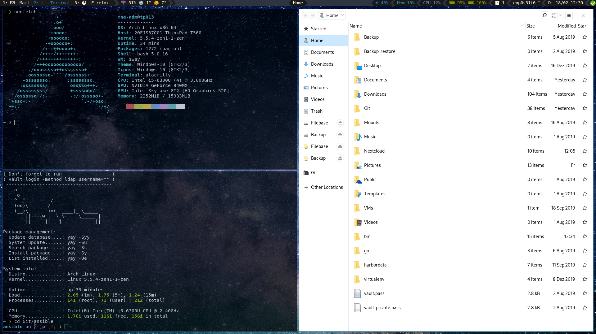

# Sway []()  [](https://opensource.org/licenses/MIT)

<div align="center"><b><a href="https://swaywm.org/" target="_blank">Sway</a> configuration of my desktop environment.</b></div>



## Table of content

* [Current setup](#current-setup)
* [Installation](#installation)
* [Hotkeys](#hotkeys)
* [Custom Sway configuration](#custom-sway-configuration)
  * [Device specific configuration](#device-specific-configuration)
* [Custom bash configuration](#custom-bash-configuration)
* [Mozilla Firefox and Thunderbird](#mozilla-firefox-and-thunderbird)
* [Notes](#notes)

## Current setup

* **OS:** [Arch](https://www.archlinux.org/)
* **Shell:** [Bash](https://www.gnu.org/software/bash/)
* **Wayland compositor:** [Sway](https://github.com/swaywm/sway)
* **Bar:** [i3status-rust](https://github.com/greshake/i3status-rust)
* **Launcher:** [Rofi](https://github.com/davatorium/rofi)
* **Terminal:** gnome-terminal
* **Color Scheme:** Based on [Nord theme](https://www.nordtheme.com/)
* **GTK:** [Windows 10](https://www.gnome-look.org/p/1013482/)
* **Icons:** [Windows 10](https://github.com/B00merang-Artwork/Windows-10)
* **Prompt:** [Starship](https://github.com/starship/starship)

## Prerequisites

* git
* ansible >= 2.7
* When using arch: [ansible-aur module](https://github.com/kewlfft/ansible-aur), though it will be installed when using the playbook setup01-arch-prerequirements.yml

## Installation

I prefer using ansible for managing my desktop environment so you need it to install everything.

* integrated idemptotence tests
* templating
* been using it on a daily base
* can use system facts, e.g. ansible_distribution

```bash
ansible-playbook setup-01-arch-prerequirements.yml -K -e 'ansible_python_interpreter=/usr/bin/python3'
ansible-playbook setup-02-de.yml -K -e 'ansible_python_interpreter=/usr/bin/python3'
ansible-playbook setup-03-additions-arch.yml -K -e 'ansible_python_interpreter=/usr/bin/python3'
```

At the moment main focus is on arch, was previously on Fedora. But Fedora has become obsolete and removed.

The ansible playbook will do the following changes to the system:

* Add the following repos from fedora copr:

  * [gumieri/sway](https://copr.fedorainfracloud.org/coprs/gumieri/sway/) for sway

  * [knopki/desktop](https://copr.fedorainfracloud.org/coprs/knopki/desktop/) for some tools

* Install required software (see the playbook *.yml files for details)

* Files from the config folder will be symlinked to the appropriate location

* Enables ssh-agent via systemd --user

* i3block scripts will be downloaded from [i3-contrib repository](https://github.com/vivien/i3blocks-contrib) to ~/bin/blocks

* Downloads Windows-10 themes and icons to ~/.themes and ~/.icons

* Sets Windows-10 themes and icons in ~/.config/gtk-3.0/settings.ini and ~/.gtkrc-2.0

  * ~/.config/gtk-3.0/settings.ini

  ```bash
  [Settings]
  gtk-theme-name = Windows-10
  gtk-icon-theme-name = Windows-10
  ```

  * ~/.gtkrc-2.0

  ```bash
  gtk-theme-name = Windows-10
  gtk-icon-theme-name = Windows-10
  ```

* [Add entries to /root/.bashrc and ~/.bashrc](#custom-bash-configuration)

* Install / remove some GTK applications I need. I try to avoid QT applications if I'm not forced to use them...

## Hotkeys

This is not a list of all hotkeys but more for some none defaults. You can view all hotkeys in **config/sway.d/07_hotkeys.conf**.

Or alternatively in the [HOTKEYS.md](HOTKEYS.md) file.

By default $mod is the super key (or windows key).

| Action | Binding |
| --- | --- |
| Open menu | $mod+d |
| Toggle Redshift | $mod+Shift+t |
| Make current focus fullscreen | $mod+f |
| Make current container fullscreen | $mod+Shift+f |
| Open gnome-terminal from scratchpad | $mod+t |
| Open KeePass2 from scratchpad | $mod+k |
| Screenshot whole screen | Print |
| Screenshot focused window | $mod+Print |
| Screenshot selected region | $mod+Shift+Print |
| Auto activates output configuration from [swayoutputctl](https://gitlab.com/kujeger/swayoutputctl) | $mod+Shift+r |
| Desktop color picker | $mod+c |
| Open floating germinal | Menu |

Screenshots are saved to **$XDG_PICTURES_DIR/screenshot_YYYY-MM-DD_HH24-MI-SS_SSS.png** and the path is copied to clipboard.

## Custom Sway configuration

In git all config/sway.d/99_*.conf files are ignored. You can add your own configuration there.

Alternatively you can create a folder with the hostname of your device and put device specific configuration in there.

```bash
mkdir -p $HOME/.config/sway/$(hostname)
```

### Device specific configuration

At the moment the following settings are considered device specific:

* Background (02_output.conf)

* Display (02_output.conf)

* Workspace to monitor assignment (03_workspace.conf)

* Bar (09_bar.conf)

The files do provide some commented examples. You can copy them to **$HOME/.config/sway/$(hostname)** and adjust them to your needs.

## Custom bash configuration

The playbooks do add the following lines to your ~/.bashrc and /root/.bashrc:

```bash
 # BEGIN Sway desktop environment config
for f in ~/.config/bash/*.sh; do source $f; done
 # END Sway desktop environment config
```

This will source all *.sh files from your ~/.config/bash folder.

## Mozilla Firefox and Thunderbird

Both applications will be started with native wayland support. For best performance in Firefox you need to enable the new WebRender.

```clean
about:config --> gfx.webrender.all --> Value: True
```

To verify if it's enabled go to **about:support** and check if **Compositing** contains the value **WebRender**. This can lead to problems on some configurations because the WebRender is still beta.

## Notes

* On Fedora the bar is commented because I'm testing [i3status-rust](https://github.com/greshake/i3status-rust) as an alternative bar. If you want to activate i3blocks copy the file **config/sway.d/09_bar.conf** to something like **99_bar.conf** and uncomment all required settings. On Arch i3status-rust will be installed.
