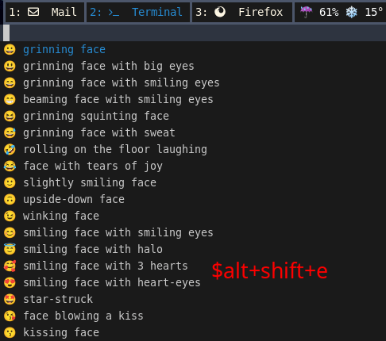
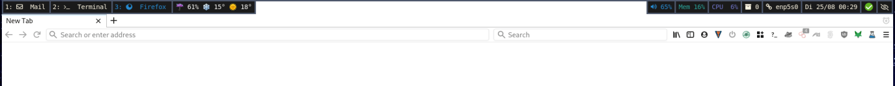

# Screenshots

## Desktop

## Visualized volume change via avizo

## Desktop notification from mako

## Menu (bemenu) ($mod+d)

## Remontoire (Hotkey Overview) ($mod+shift+k)

## Emoji selector ($alt+shift+e)

## Color adaptive waybar

