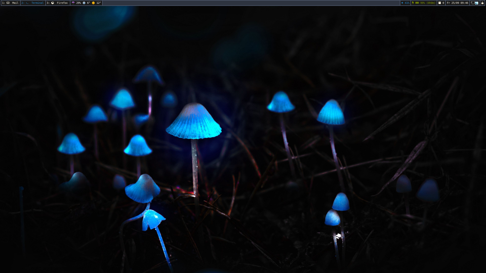
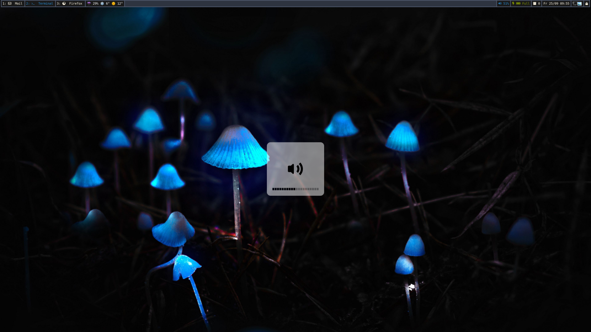
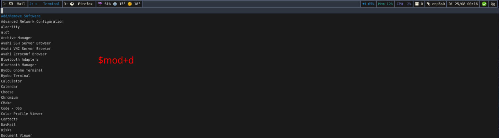

# Screenshots

## Desktop

## Desktop without windows

## Visualized volume change via avizo

## Desktop notification from mako

## Menu (bemenu) ($mod+d)

## Remontoire (Hotkey Overview) ($mod+shift+k)

## Emoji selector ($alt+shift+e)

## Color adaptive waybar

## Lockscreen

## Flatpak Support

The menu displays both flatpak and normal desktop apps.

To be able to distinguish which version to start, the menu shows which binary would be executed.

