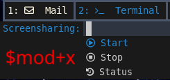
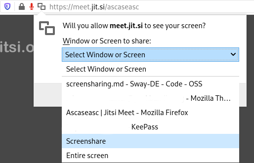

# Screensharing

Screensharing is based upon a solution from a [reddit thread](https://www.reddit.com/r/swaywm/comments/di7ev1/screensharing_w_sway_possible/), modified to not require the v4l2loopback kernel module and it's piping the content from wf-recorder directly to ffplay instead of using /dev/video2.

Basically it records the desktop, or a selectable part of it, with wf-recorder and opens the recorded part with ffplay in an X-window. The X-window can than be selected as an application in every screenshare scenario (e.g. Zoom or Jitsi).

## Usage

Start screensharing with $mod+x

* s = start screensharing
* t = stop screensharing
* a = is screensharing running

When starting a new scrensharing session, you can select to either record the complete screen or only an application. Please keep in mind that in the background this will only generate a region for wf-recorder to record. Every application that is visible inside this region will be recorded. After selecting the region, an ffplay floating window with the title "Screenshare" should open in the bottom right corner. This is the window you select as screensharing target.

